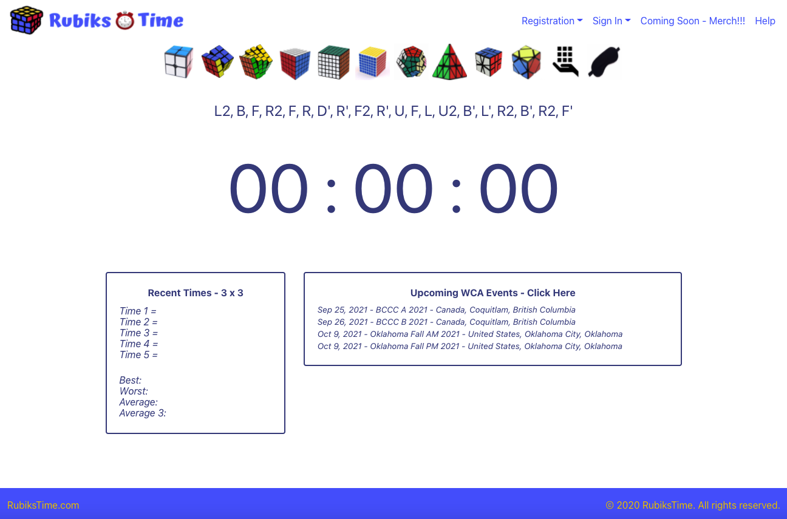
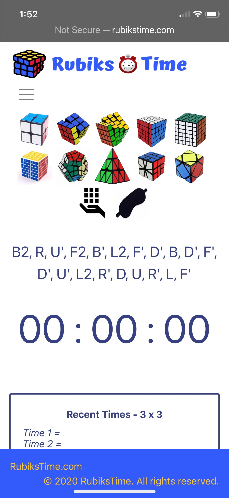

Jamie Vullo and Kelley Chaplain | Javascript, React, Ruby, and Rails as an API.

# RubiksTime.com
Register and keep track of your speedcubing times for all cubes used. Registration unlocks lifetime stats for each cube and all times recorded. The application also features an e-commerce store*.  

# Jamie Vullo - Full-Stack Software Engineer - www.jamievullo.com

*e-commerce with stripe integration coming soon
